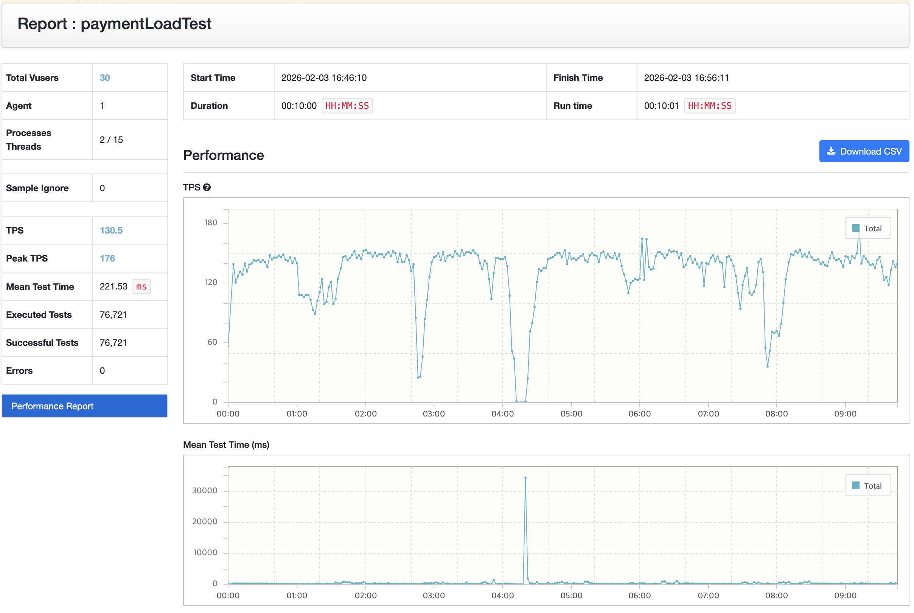
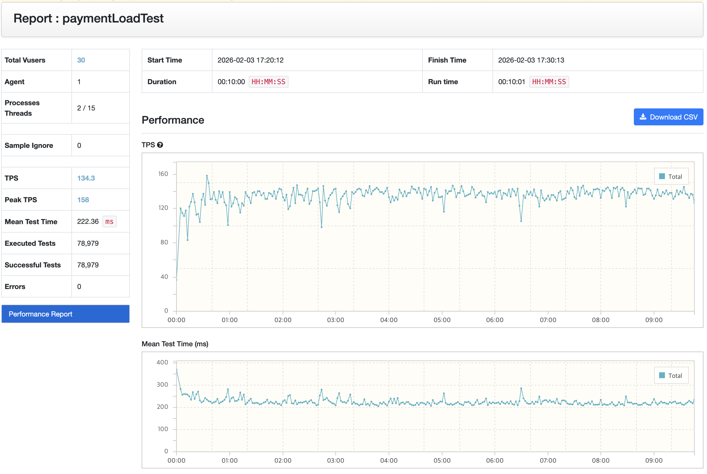
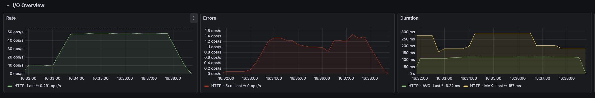
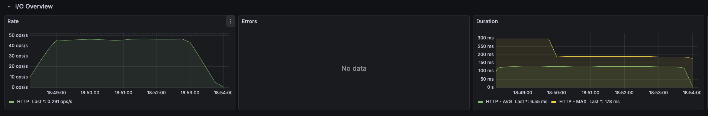

# **🏦 Bank System Performance Experiment (Spring + Redis)**

이 프로젝트는 기존 **Java CLI 기반 Bank System**을 출발점으로,

Spring Boot 기반의 API 서버로 확장하고,

**Redis 도입과 부하 테스트를 통해 성능 개선을 실험**해 본 프로젝트입니다.

> 📌 기존 Java CLI Bank System 프로젝트

> 👉 [**CLI Bank System Repository**](https://github.com/fhdnwlqkd/bank-program)

----------

## **🎯 Project Goals**

이 프로젝트의 목적은 단순한 기술 전환이 아니라,

**기능 확장 → 성능 병목 가정 → 실험 → 검증**의 과정을 직접 경험해 보는 것이었습니다.

특히 다음과 같은 질문에서 출발했습니다.

-   Java CLI 기반 시스템을 **확장 가능한 서버 구조**로 바꾸면 무엇이 달라질까?

-   트래픽이 집중되는 계좌나 결제 로직에 **Redis를 적용하면 실제로 성능이 개선될까?**

-   부하 테스트 결과를 **어떤 기준으로 해석해야 할까?**

----------

## **🛠️ What I Built**

### **1. Java CLI → Spring Boot API (기능 확장 포함)**

기존 Java CLI 기반 Bank System을 단순히 Spring 구조로 옮기는 데 그치지 않고,

**기능 확장을 전제로 한 API 서버 구조**로 재구성했습니다.

-   계좌 생성, 조회, 입출금, 이체 기능을 REST API로 분리

-   **Card Payment(카드 결제)** 와 **Payment Refund(결제 환불)** 시나리오를 새롭게 추가하여 결제 트랜잭션 흐름이 복잡해질 수 있는 상황을 가정

-   기능 확장을 고려해 도메인 역할과 책임을 명확히 분리

이를 통해 과제 수준의 구현이 아니라,

**기능이 계속 추가될 수 있는 시스템 구조를 만드는 것을 목표**로 했습니다.

----------

### **2. Redis 적용 (Hot Account / 결제 트래픽 가정)**

-   조회·갱신 요청이 집중될 수 있는 특정 계좌 및 결제 관련 데이터에 Redis 적용

-   카드 결제와 같이 **짧은 시간에 반복 접근이 발생할 수 있는 로직**을 중심으로 캐싱 전략 시도

-   DB 직접 접근 대비 응답 성능 개선을 기대

----------

## **📊 Load Test & Experiment**

### **Local 환경 테스트**

초기에는 로컬 환경에서 **nGrinder**를 활용해 부하 테스트를 진행했습니다.

-   **Redis 적용 전 / 후 비교**

-   TPS, 응답 시간 변화를 기준으로 성능 차이 확인 시도

다만 로컬 환경에서는 테스트 결과의 신뢰도와 해석에 한계가 있다고 판단했습니다.

----------

### **AWS 환경으로 실험 확장**

로컬 환경의 한계를 보완하기 위해,

실제 서비스 환경을 가정한 **AWS 기반 분산 테스트 환경**을 구성했습니다.

구성은 다음과 같습니다.

-   **Spring Application**

-   **Redis / Database**

-   **nGrinder Controller, Prometheus + Grafana (모니터링)**

-   **nGrinder Agent**

각 컴포넌트를 분리하여 배포한 뒤,

동일한 부하 시나리오로 Redis 적용 전·후 테스트를 반복했습니다.

----------

### 📊 Load Test Result – nGrinder

#### 🔹 Without Redis

 

#### 🔹 With Redis

### 📈 Monitoring – Grafana

#### 🔹 Without Redis

#### 🔹 With Redis

AWS 환경에서도 Redis 적용 전·후의 성능 차이는

**기대했던 만큼 명확하게 드러나지 않았습니다.**

-   TPS와 응답 시간에서 큰 변화 없음

-   로컬 환경과 유사한 결과가 반복됨

이를 통해 단순히 환경을 분리하거나 클라우드에 배포하는 것만으로는

**성능 병목의 원인이나 개선 효과를 명확히 검증하기 어렵다는 점**을 체감했습니다.

----------

## **🧠 What I Learned**

이 프로젝트를 통해 다음과 같은 문제의식을 갖게 되었습니다.

-   Redis 도입 여부보다 먼저,

    -   어떤 요청이 실제로 병목이 되는지

    -   부하 시나리오가 사용 패턴을 제대로 반영하고 있는지

        를 정의하는 것이 중요하다

-   성능 개선은 기술 적용 자체보다

    **가설 설정 → 실험 → 검증 과정의 설계 문제**에 가깝다

-   테스트 환경을 분리하고 모니터링을 붙이는 것만으로는

    **성능을 판단할 기준이 자동으로 생기지 않는다**

이번 프로젝트는 성능을 크게 개선한 사례라기보다,

**성능을 어떻게 실험하고 해석해야 하는지에 대한 기준이 왜 필요한지 깨닫게 된 경험**이었습니다.

----------

## **🔭 Next Steps (Planned)**

-   트래픽 시나리오를 실제 사용 패턴에 더 가깝게 재설계

-   병목 후보 구간을 명확히 한 뒤 Redis 재적용 실험

-   단순 TPS 외에 지연 분포(latency percentile) 중심 분석 시도

----------

## **🔗 Related Projects**

-   **Java CLI Bank System**

    👉 [CLI Bank System Repository](https://github.com/fhdnwlqkd/bank-program)

----------